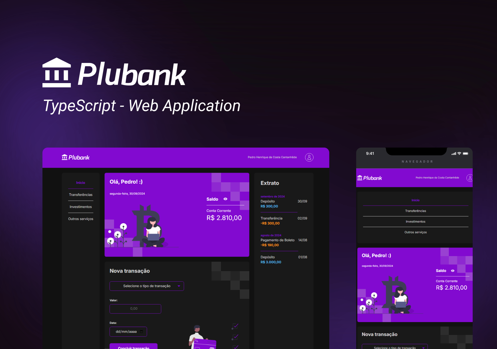
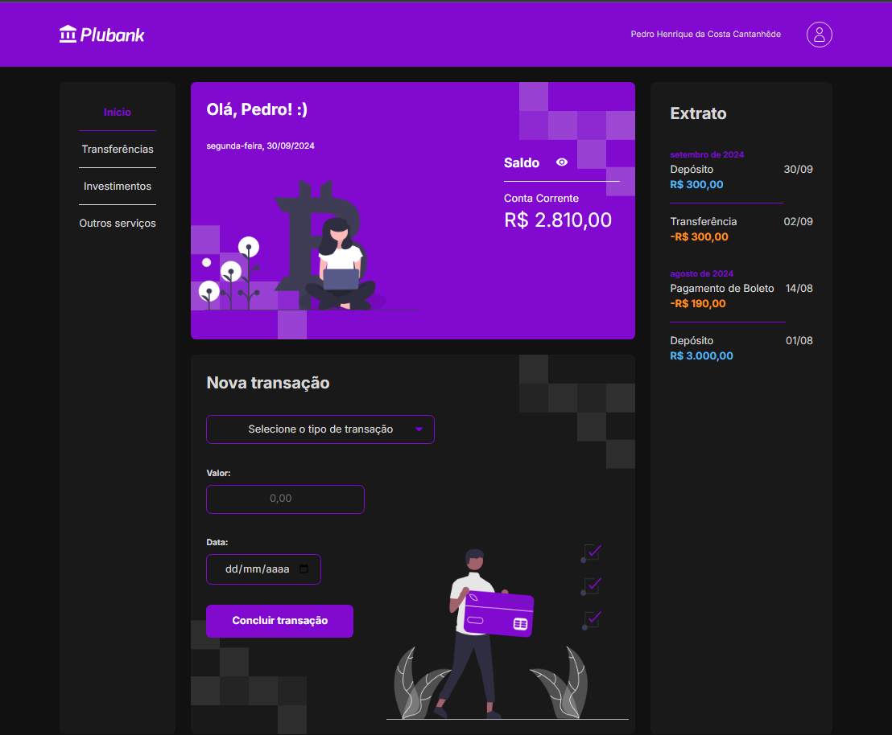
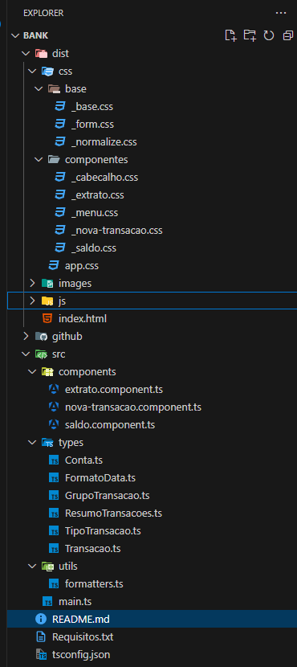

<h1 align="center">
    💷 Plubank 💷
</h1>

<div align="center">
    <a href="https://github.com/PedroCantanhede" target="_blank">
      
    </a>
     
    
    
</div>

<p align="center">
  
</p>

# Plubank

Este aplicativo foi desenvolvido utilizando TypeScript. O Plubank é uma aplicação bancária que permite aos usuários realizar operações essenciais como depósito, transferência e pagamento de boletos, além de consultar o extrato das suas transações.

# 🔨 Tecnologias

💻 TypeScript

💻 HTML

💻 CSS


# 🔨 Funcionalidades

✅ Depósito: Permite ao usuário adicionar fundos à sua conta.

✅ Transferência: Realize transferências para outras contas de forma prática e segura.

✅ Pagamento de boletos: Pague seus boletos diretamente pelo app.

✅ Consulta de extrato: Acompanhe suas movimentações e mantenha controle sobre sua conta.


## :camera: Veja:

### App




### Estrutura do Projeto:



## :rocket: Instalação

```bash
# Clone o repositório em alguma pasta
$ git clone https://github.com/PedroCantanhede/Plubank.git

# Execute o projeto
$ tsc -w

```
## 🧠 Alura

Através do curso "TypeScript na prática: implemente um projeto completo com TypeScript e módulos" fiz esse projeto colocando todos os conhecimentos das aulas em prática. Dá uma olhada na plataforma através [desse link](https://www.alura.com.br/).